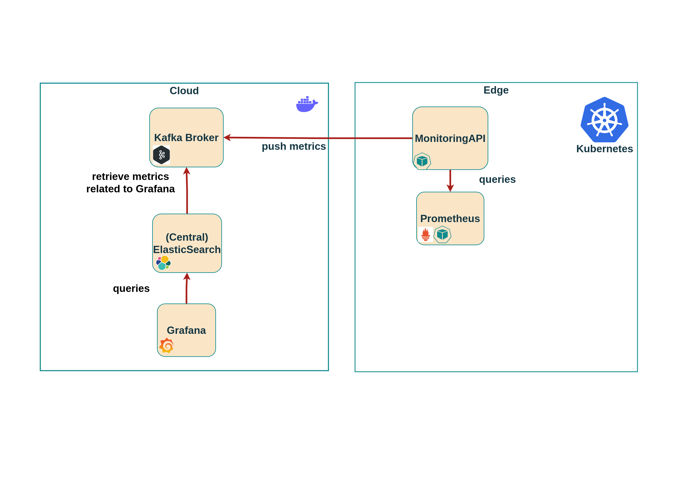

# MonitoringAPI container

The monitoringAPI container performs regular queries to Prometheus, retrieving all metric sets and forwarding them to a Kafka broker. It's worth noting that the MonitoringAPI serves no purpose beyond the ACCORDION platform. Its sole function is to facilitate the transfer of data to a Kafka broker with a persistent volume hosted in the cloud. This setup aims to optimize the monitoring of K3s on edge clusters with limited resources, making it more efficient and lightweight.





Important: The Kafka broker, Elasticsearch, and Grafana, which store and visualize data, are not integral components of this monitoring stack. Instead, they are utilized solely to gather data from various instances of our monitoring stack and present it to users. The Kafka topics are presented in the following Table.

|                 Topic                 |                                                                                                                                                                                                                  Description                                                                                                                                                                                                                   |
|:-------------------------------------:|:----------------------------------------------------------------------------------------------------------------------------------------------------------------------------------------------------------------------------------------------------------------------------------------------------------------------------------------------------------------------------------------------------------------------------------------------:|
|    accordion.monitoring.currentPod    | This topic offers a range of metrics that reflect the utilization of pods, with the maximum value of each metric over the past minute being reported. For each pod, information is provided on the node where it is running, the namespace it belongs to, and the geolocation of the host. The metrics include CPU usage, memory usage, transmit and receive bandwidth, and the number of threads. The information is updated every 60 seconds |
|  accordion.monitoring.GrafanaMetrics  |                                                                             This topic comprises the identical metric sets found in accordion.monitoring.currentPod and accordion monitoring.currentVM, but the values are the current or instantaneous  values rather than the maximum value of the last minute. The information is refreshed  every 30 seconds.                                                                              |
| accordion.monitoring.currentNamespace |                                                            This topic furnishes a collection of metrics that reflect the utilization of namespaces, with the maximum value of each metric over the past minute being reported. The metrics include CPU usage, memory usage, transmit and receive bandwidth, and the number of threads. The information is updated every 60 seconds.                                                            |
|  accordion.monitoring.podInformation  |                                                                               This topic provides comprehensive descriptive information about pods, including the number of replicas, the namespace to which the pod belongs, the host node, node IP, pod IP, pod status, external IPs, and the applied pod labels. The information is updated every 40 seconds.                                                                               |
|    accordion.monitoring.currentVM     |                                                               This topic reports metrics for VM usage, including CPU usage, memory usage, transmit and receive bandwidth, and number of threads. Values are the maximum of the last minute for each VM and are updated every 60 seconds. Information includes the VM, host node, namespace, geolocation, and applied VM labels.                                                                |
|  accordion.monitoring.vmInformation   |                                                                                           Similar to accordion.monitoring.podInformation, this topic provides information on virtual machines including their status, external IP (if available), applied labels, and the namespace and node where they are hosted. It is refreshed every 40 seconds                                                                                           |
|     accordion.monitoring.platform     |                                                                                      This topic provides information about the performance of various components that make up the MiniCloud platform. It reports the current values of CPU usage, RAM usage, and the number of threads for each component. This information is updated every 40 seconds.                                                                                       |
## Build image


```bash
cd monitoringapi
docker buildx build --platform linux/arm/v7,linux/arm64/v8,linux/amd64 -t gkorod/monitoringapi:v1.0 --push .

```
